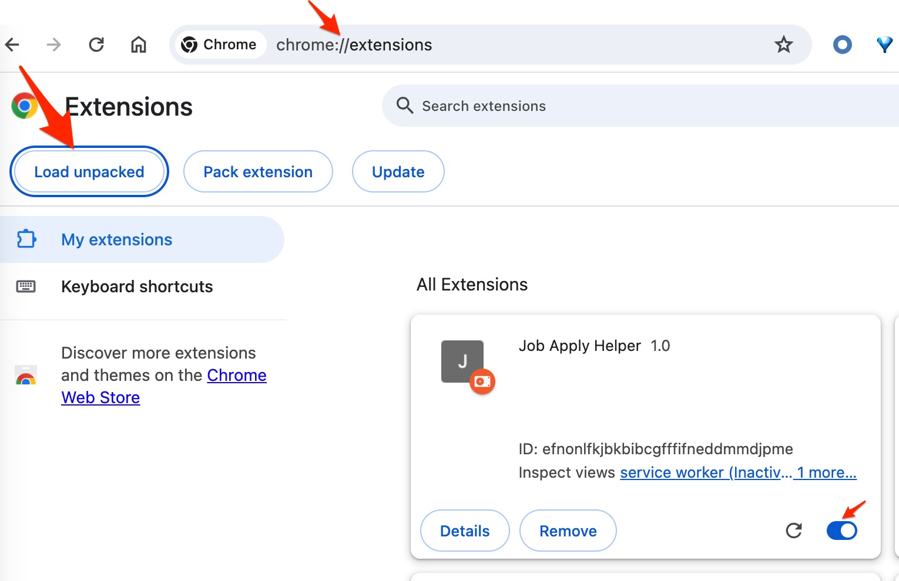
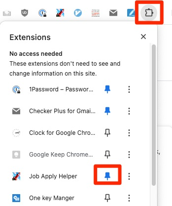
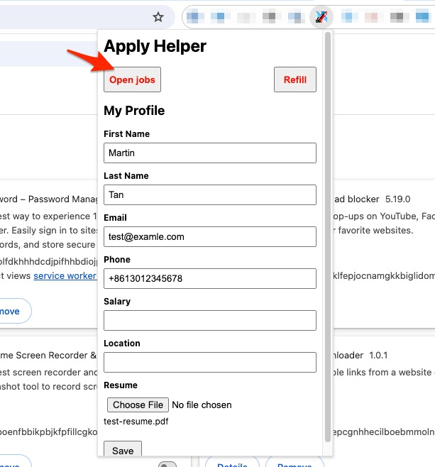
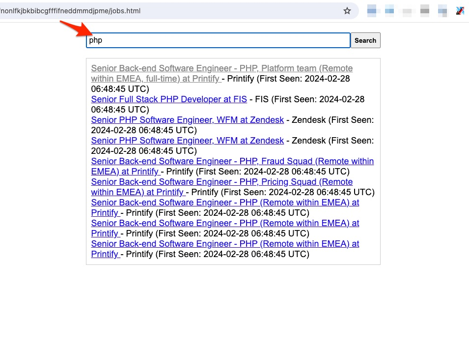
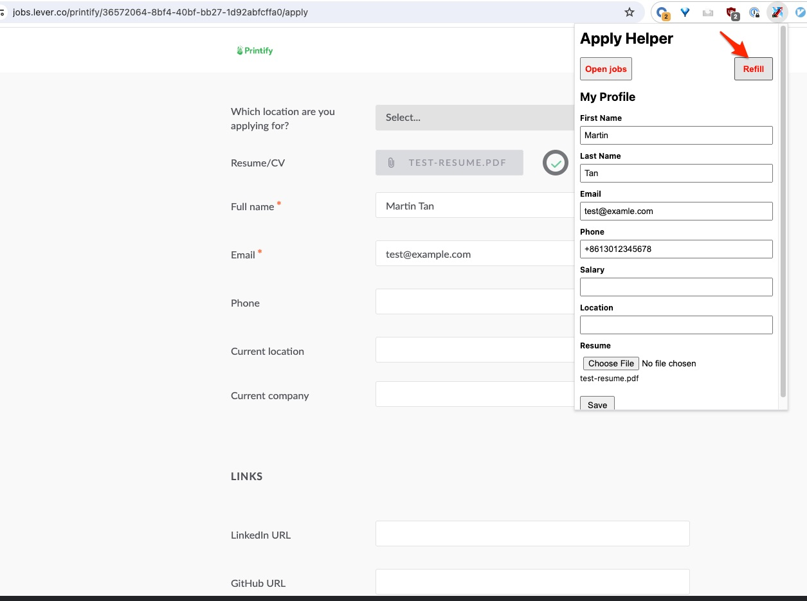

#  🤖 Job Bender - a Job Apply Helper

A Chrome extension job apply for auto fill the forms on job position pages.

⚠️ This extension is still under development, it may contain bugs 👾

## Features

| Features | Status |
| ------------------------------------------- | ---- |
| 💾 Save data for later use                   | ✅    |
| 🛡️ All your data are saved on your local     | ✅    |
| 💻 Opening jobs list                         | ✅    |
| 🤖 Auto fill an apply form after page loaded | ✅    |
| 🤾 Refill an apply form manually             | ✅    |
| 🤮 Mark stale jobs | 🚫 |
| 📝 Record applied jobs | 🚫 |

## How to setup

1. open Chrome and clone this repo `git clone https://github.com/okoddcat/job-bender.git`
2. `git pull` if you want to pull down the latest jobs
3. go to chrome extensions `chrome://extensions/`
4. click on the ` Load unpacked` button and choose this repo
5. Pin this extension at the top right corner of your Chrome bar
6. Done :rocket:

| Load extension | Pin extension |
| ---- | ---- |
|  |  |

## How to use

1. click on the extension icon
2. fill your profile on the popup page
3. click on the icon then click the  `Open Jobs` button to see new jobs
4. search and click a job
5. then you should see the form is filled, also you can click the `Refill` button to refill
6. check the form and submit :rocket:

| Opening jobs                               | Search jobs                               | Refill                               |
| ------------------------------------------ | ----------------------------------------- | ------------------------------------ |
|  |  |  |

## License

[Creative Commons Attribution-NonCommercial-NoDerivatives 4.0 International License](http://creativecommons.org/licenses/by-nc-nd/4.0/).
